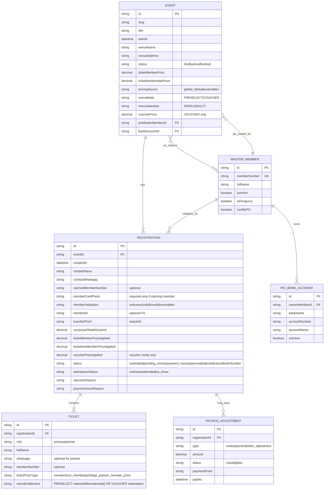
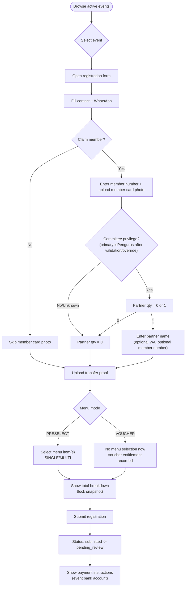
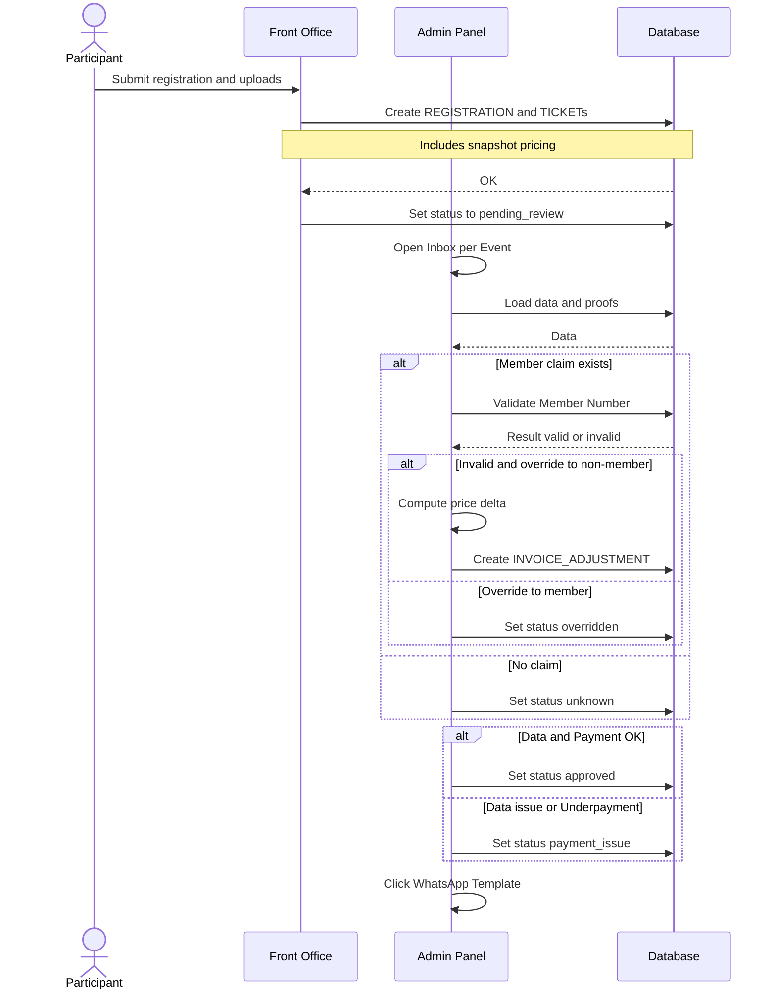
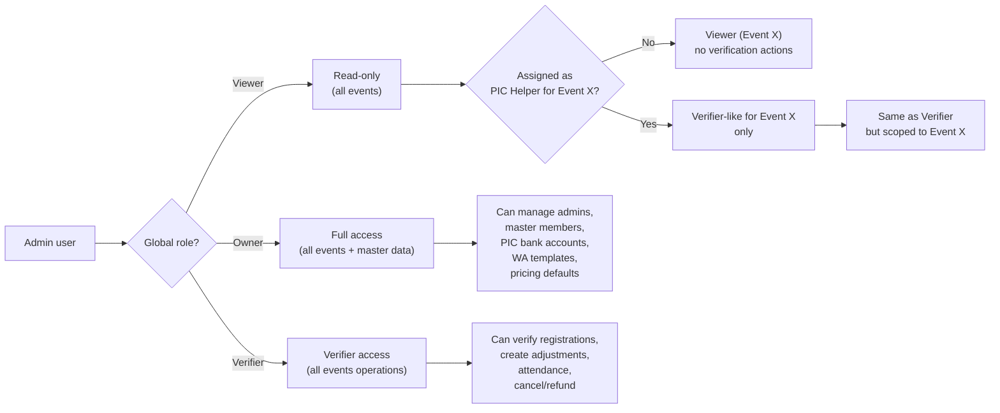

# Nobar CISC Tangsel — Mermaid Diagrams

Source spec: `docs/superpowers/specs/2026-04-29-nobar-cisc-tangsel-design.md`

## 1) Conceptual Data Model (ERD)

## 2) Registration + Attendance Status Machine

```mermaid
stateDiagram-v2
%% See: ./registration-status.state.mmd
  [*] --> submitted
  submitted --> pending_review: system\n(post-submit)

  pending_review --> approved: admin approve
  pending_review --> payment_issue: admin flags issue
  pending_review --> rejected: admin reject (reason)
  pending_review --> cancelled: admin cancel

  payment_issue --> pending_review: participant/admin resolves\n(new proof / adjustment)
  payment_issue --> rejected: admin reject
  payment_issue --> cancelled: admin cancel

  approved --> cancelled: admin cancel
  approved --> refunded: refund processed

  %% Attendance is tracked separately but meaningful mainly for approved
  state "attendanceStatus" as AS {
    [*] --> unknown
    unknown --> attended: set after event day
    unknown --> no_show: set after event day
  }
```

## 3) Participant Journey (Front Office)

## 4) Admin Verification + Underpayment Adjustments

## 5) Permissions (Hybrid: Global Role + PIC Helper Grant)

