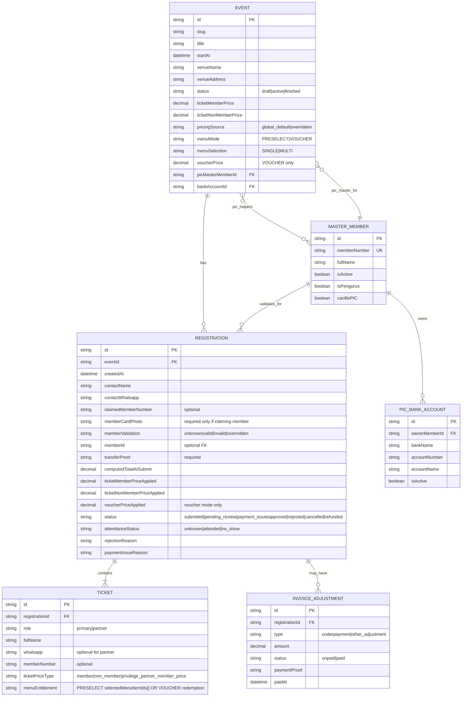
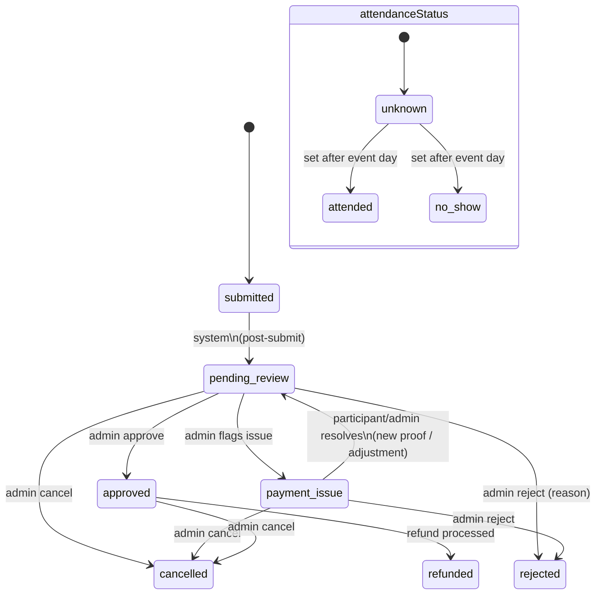
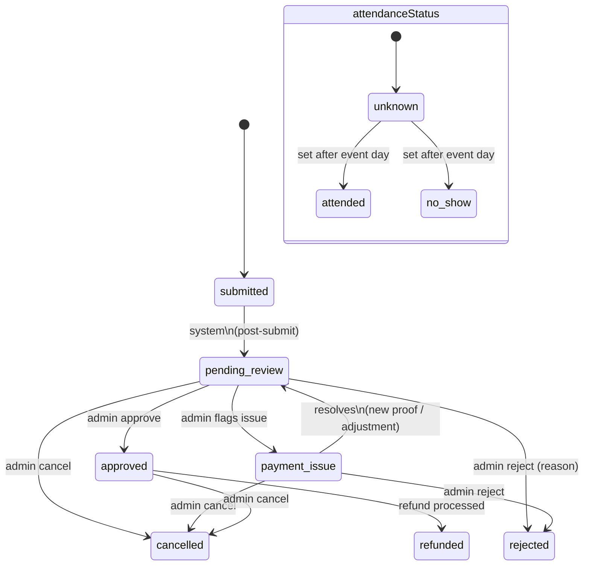

# Nobar CISC Tangsel Mermaid Diagrams Implementation Plan

> **For agentic workers:** REQUIRED SUB-SKILL: Use superpowers:subagent-driven-development (recommended) or superpowers:executing-plans to implement this plan task-by-task. Steps use checkbox (`- [ ]`) syntax for tracking.

**Goal:** Produce a complete Mermaid diagram set (data model + flows + state machine + permissions) for `Nobar CISC Tangsel — Registration + Admin Panel` based on `docs/superpowers/specs/2026-04-29-nobar-cisc-tangsel-design.md`.

**Architecture:** Store diagrams as versioned `.mmd` files under `docs/superpowers/diagrams/` and maintain a single “index” markdown that embeds them. This keeps each diagram focused while still giving stakeholders one page to read.

**Tech Stack:** Mermaid (Markdown + `.mmd`), optional `@mermaid-js/mermaid-cli` for local validation/export.

---

## File structure (locked)

**Create:**
- `docs/superpowers/diagrams/2026-04-29-nobar-cisc-tangsel/README.md` — index page embedding all diagrams
- `docs/superpowers/diagrams/2026-04-29-nobar-cisc-tangsel/erd.mmd` — conceptual ERD / data model
- `docs/superpowers/diagrams/2026-04-29-nobar-cisc-tangsel/registration-status.state.mmd` — registration + attendance state machine
- `docs/superpowers/diagrams/2026-04-29-nobar-cisc-tangsel/participant-journey.flow.mmd` — participant UX flow
- `docs/superpowers/diagrams/2026-04-29-nobar-cisc-tangsel/admin-verification.sequence.mmd` — admin inbox verification + adjustments sequence
- `docs/superpowers/diagrams/2026-04-29-nobar-cisc-tangsel/permissions.flow.mmd` — hybrid permissions (global role + PIC helper grant)

**Optional (only if you want local PNG/SVG export):**
- `package.json` (modify) — add `@mermaid-js/mermaid-cli` devDependency + scripts

---

### Task 1: Create diagrams index (single page)

**Files:**
- Create: `docs/superpowers/diagrams/2026-04-29-nobar-cisc-tangsel/README.md`

- [ ] **Step 1: Create the README index**

```markdown
# Nobar CISC Tangsel — Mermaid Diagrams

Source spec: `docs/superpowers/specs/2026-04-29-nobar-cisc-tangsel-design.md`

## 1) Conceptual Data Model (ERD)



## 2) Registration + Attendance Status Machine



## 3) Participant Journey (Front Office)

```mermaid
flowchart TD
  %% See: ./participant-journey.flow.mmd
  A([Browse active events]) --> B{Select event}
  B --> C[Open registration form]
  C --> D[Fill contact + WhatsApp]
  D --> E{Claim member?}
  E -->|No| F[Skip member card photo]
  E -->|Yes| G[Enter member number + upload member card photo]

  G --> H{Committee privilege?\n(primary isPengurus after validation/override)}
  H -->|No/Unknown| I[Partner qty = 0]
  H -->|Yes| J[Partner qty = 0 or 1]
  J -->|1| K[Enter partner name\n(optional WA, optional member number)]
  J -->|0| I

  F --> L[Upload transfer proof]
  I --> L
  K --> L

  L --> M{Menu mode}
  M -->|PRESELECT| N[Select menu item(s)\nSINGLE/MULTI]
  M -->|VOUCHER| O[No menu selection now\nVoucher entitlement recorded]

  N --> P[Show total breakdown\n(lock snapshot)]
  O --> P
  P --> Q[Submit registration]
  Q --> R[Status: submitted → pending_review]
  R --> S[Show payment instructions\n(event bank account)]
```

## 4) Admin Verification + Underpayment Adjustments

```mermaid
sequenceDiagram
  %% See: ./admin-verification.sequence.mmd
  actor Participant
  participant FO as Front Office (Next.js)
  participant Admin as Admin Panel
  participant DB as Database

  Participant->>FO: Submit registration + uploads
  FO->>DB: Create REGISTRATION (status=submitted)\n+ TICKET(s)\n+ snapshot pricing
  DB-->>FO: OK
  FO->>DB: Transition status -> pending_review

  Admin->>Admin: Open Registration Inbox (per event)
  Admin->>DB: Load registration + proofs + tickets
  DB-->>Admin: Data

  alt Claimed member number provided
    Admin->>DB: Validate against MASTER_MEMBER
    DB-->>Admin: valid / invalid
    alt Invalid and override to non-member
      Admin->>Admin: Compute delta (non-member - member)
      Admin->>DB: Create INVOICE_ADJUSTMENT (type=underpayment, status=unpaid)
    else Override to member (operational)
      Admin->>DB: Set memberValidation=overridden\nand map memberId (optional)
    end
  else No member claim
    Admin->>DB: memberValidation=unknown (keep)
  end

  alt Proof OK and totals OK
    Admin->>DB: Set status=approved
  else Proof missing/incorrect OR underpayment unpaid
    Admin->>DB: Set status=payment_issue (reason)
  end

  Admin->>Admin: Click wa.me template\n(receipt/issue/underpayment/approved)
```

## 5) Permissions (Hybrid: Global Role + PIC Helper Grant)

```mermaid
flowchart LR
  %% See: ./permissions.flow.mmd
  A[Admin user] --> B{Global role?}

  B -->|Owner| O[Full access\n(all events + master data)]
  B -->|Verifier| V[Verifier access\n(all events operations)]
  B -->|Viewer| W[Read-only\n(all events)]

  %% Hybrid rule for Viewer
  W --> C{Assigned as\nPIC Helper for Event X?}
  C -->|No| W1[Viewer (Event X)\nno verification actions]
  C -->|Yes| Vx[Verifier-like for Event X\nonly]

  %% Constraints on event setup
  O --> E1[Can manage admins,\nmaster members,\nPIC bank accounts,\nWA templates,\npricing defaults]
  V --> E2[Can verify registrations,\ncreate adjustments,\nattendance,\ncancel/refund]
  Vx --> E3[Same as Verifier\nbut scoped to Event X]
```
```

- [ ] **Step 2: Save file**

Run: `git status --porcelain`
Expected: shows new file `docs/superpowers/diagrams/2026-04-29-nobar-cisc-tangsel/README.md`

- [ ] **Step 3: (Optional) Preview render**
  - Open `docs/superpowers/diagrams/2026-04-29-nobar-cisc-tangsel/README.md` in an editor that renders Mermaid.

- [ ] **Step 4: Commit**

```bash
git add docs/superpowers/diagrams/2026-04-29-nobar-cisc-tangsel/README.md
git commit -m "docs: add nobar tangsel diagram index"
```

---

### Task 2: Split diagrams into focused `.mmd` files

**Files:**
- Create: `docs/superpowers/diagrams/2026-04-29-nobar-cisc-tangsel/erd.mmd`
- Create: `docs/superpowers/diagrams/2026-04-29-nobar-cisc-tangsel/registration-status.state.mmd`
- Create: `docs/superpowers/diagrams/2026-04-29-nobar-cisc-tangsel/participant-journey.flow.mmd`
- Create: `docs/superpowers/diagrams/2026-04-29-nobar-cisc-tangsel/admin-verification.sequence.mmd`
- Create: `docs/superpowers/diagrams/2026-04-29-nobar-cisc-tangsel/permissions.flow.mmd`

- [ ] **Step 1: Create `erd.mmd`**


- [ ] **Step 2: Create `registration-status.state.mmd`**



- [ ] **Step 3: Create `participant-journey.flow.mmd`**

```mermaid
flowchart TD
  A([Browse active events]) --> B{Select event}
  B --> C[Open registration form]
  C --> D[Fill contact + WhatsApp]
  D --> E{Claim member?}
  E -->|No| F[Skip member card photo]
  E -->|Yes| G[Enter member number + upload member card photo]

  G --> H{Committee privilege?\n(primary isPengurus after validation/override)}
  H -->|No/Unknown| I[Partner qty = 0]
  H -->|Yes| J[Partner qty = 0 or 1]
  J -->|1| K[Enter partner name\n(optional WA, optional member number)]
  J -->|0| I

  F --> L[Upload transfer proof]
  I --> L
  K --> L

  L --> M{Menu mode}
  M -->|PRESELECT| N[Select menu item(s)\nSINGLE/MULTI]
  M -->|VOUCHER| O[No menu selection now\nVoucher entitlement recorded]

  N --> P[Show total breakdown\n(lock snapshot)]
  O --> P
  P --> Q[Submit registration]
  Q --> R[Status: submitted → pending_review]
  R --> S[Show payment instructions\n(event bank account)]
```

- [ ] **Step 4: Create `admin-verification.sequence.mmd`**

```mermaid
sequenceDiagram
  actor Participant
  participant FO as Front Office (Next.js)
  participant Admin as Admin Panel
  participant DB as Database

  Participant->>FO: Submit registration + uploads
  FO->>DB: Create REGISTRATION (status=submitted)\n+ TICKET(s)\n+ snapshot pricing
  DB-->>FO: OK
  FO->>DB: Transition status -> pending_review

  Admin->>Admin: Open Registration Inbox (per event)
  Admin->>DB: Load registration + proofs + tickets
  DB-->>Admin: Data

  alt Claimed member number provided
    Admin->>DB: Validate against MASTER_MEMBER
    DB-->>Admin: valid / invalid
    alt Invalid and override to non-member
      Admin->>Admin: Compute delta (non-member - member)
      Admin->>DB: Create INVOICE_ADJUSTMENT (type=underpayment, status=unpaid)
    else Override to member (operational)
      Admin->>DB: Set memberValidation=overridden\nand map memberId (optional)
    end
  else No member claim
    Admin->>DB: memberValidation=unknown (keep)
  end

  alt Proof OK and totals OK
    Admin->>DB: Set status=approved
  else Proof missing/incorrect OR underpayment unpaid
    Admin->>DB: Set status=payment_issue (reason)
  end

  Admin->>Admin: Click wa.me template\n(receipt/issue/underpayment/approved)
```

- [ ] **Step 5: Create `permissions.flow.mmd`**

```mermaid
flowchart LR
  A[Admin user] --> B{Global role?}

  B -->|Owner| O[Full access\n(all events + master data)]
  B -->|Verifier| V[Verifier access\n(all events operations)]
  B -->|Viewer| W[Read-only\n(all events)]

  W --> C{Assigned as\nPIC Helper for Event X?}
  C -->|No| W1[Viewer (Event X)\nno verification actions]
  C -->|Yes| Vx[Verifier-like for Event X\nonly]

  O --> E1[Can manage admins,\nmaster members,\nPIC bank accounts,\nWA templates,\npricing defaults]
  V --> E2[Can verify registrations,\ncreate adjustments,\nattendance,\ncancel/refund]
  Vx --> E3[Same as Verifier\nbut scoped to Event X]
```

- [ ] **Step 6: Run a basic syntax sanity check**

Run: `node -e "console.log('Mermaid files created; preview in editor that supports Mermaid')"`
Expected: prints the string (this does not validate Mermaid, it just confirms your node env).

- [ ] **Step 7: Commit**

```bash
git add docs/superpowers/diagrams/2026-04-29-nobar-cisc-tangsel/*.mmd
git commit -m "docs: add nobar tangsel mermaid diagrams"
```

---

### Task 3 (Optional): Add Mermaid CLI for local render/export

**Files:**
- Modify: `package.json`

- [ ] **Step 1: Add dev dependency + scripts**

```json
{
  "devDependencies": {
    "@mermaid-js/mermaid-cli": "^11.12.0"
  },
  "scripts": {
    "mmd:png": "mmdc -i docs/superpowers/diagrams/2026-04-29-nobar-cisc-tangsel/README.md -o docs/superpowers/diagrams/2026-04-29-nobar-cisc-tangsel/README.png"
  }
}
```

- [ ] **Step 2: Install**

Run: `npm i -D @mermaid-js/mermaid-cli`
Expected: package installed successfully

- [ ] **Step 3: Render PNG**

Run: `npm run mmd:png`
Expected: creates `docs/superpowers/diagrams/2026-04-29-nobar-cisc-tangsel/README.png`

- [ ] **Step 4: Commit**

```bash
git add package.json package-lock.json docs/superpowers/diagrams/2026-04-29-nobar-cisc-tangsel/README.png
git commit -m "chore(docs): add mermaid cli render script"
```

---

## Self-review against spec

- **Goals covered**
  - Participant registration + uploads + pricing snapshot: Participant flow + sequence + ERD.
  - Admin verification inbox actions (approve/reject/payment issue, underpayment invoice): Sequence + ERD + state machine.
  - Status workflow incl attendance + cancel/refund: State machine diagram.
  - WhatsApp click-to-chat templates: Sequence indicates `wa.me` template usage; could be expanded later with a template diagram if needed.
  - Hybrid permissions: Dedicated permissions flow.

- **Placeholder scan**
  - No “TBD/TODO”. All steps include concrete file paths and diagram content.

- **Consistency scan**
  - Status values match spec: `submitted | pending_review | payment_issue | approved | rejected | cancelled | refunded`
  - Attendance values match spec: `unknown | attended | no_show`
  - Member validation values match spec: `unknown | valid | invalid | overridden`

---

## Execution handoff

Plan complete and saved to `docs/superpowers/plans/2026-04-30-nobar-cisc-tangsel-mermaid-diagrams.md`. Two execution options:

1. **Subagent-Driven (recommended)** - I dispatch a fresh subagent per task, review between tasks, fast iteration  
2. **Inline Execution** - Execute tasks in this session using executing-plans, batch execution with checkpoints

Which approach?

