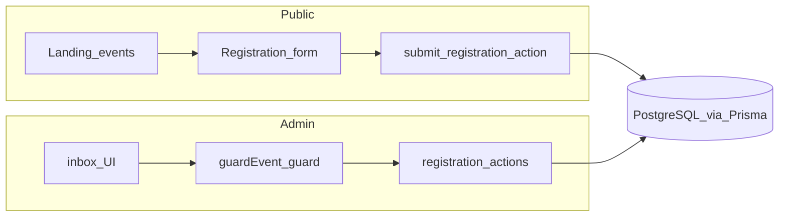

# User Stories Traceability (Match Screening)

> **For agentic workers:** REQUIRED SUB-SKILL: Use superpowers:subagent-driven-development (recommended) or superpowers:executing-plans to implement follow-up QA runs task-by-task. Steps use checkbox (`- [ ]`) syntax.

**Goal:** Memetakan user story aplikasi ke rute/modul/test yang ada supaya regressi bisa ditekan via otomasi minimal + QA manual bertarget.

**Architecture:** Dokumen ini adalah inventaris jalur utama dan gate verifikasi; tidak menginstruksikan refactor arsitektur.

**Tech Stack:** Next.js App Router, Better Auth + 2FA + magic-link, Prisma + PostgreSQL (Neon), Vitest unit tests, ESLint.

---

## Baseline automation gates

Jalankan dari root repo pada Node 24 (`nvm use`). Ekspektasi **exit code 0** untuk `pnpm lint`, `pnpm test`, dan `pnpm check-types`.

```bash
export NVM_DIR="${NVM_DIR:-$HOME/.nvm}"
[ -s "$NVM_DIR/nvm.sh" ] && . "$NVM_DIR/nvm.sh"
cd "/Users/mac/Documents/CISC/match-screening" && nvm use && pnpm lint && pnpm test && pnpm check-types
```

## Prasyarat & risiko QA

- `.env.example` → salin ke `.env.local`; isi minimal `DATABASE_URL`, `DATABASE_URL_UNPOOLED`, Better Auth vars, Blob token untuk uji jalur upload penuh.
- Email transaksional tidak dikonfigurasi → magic link mem-log URL ke konsol pengembang daripada mengirim (lihat `sendMagicLink` di [`src/lib/auth/auth.ts`](../../src/lib/auth/auth.ts)).

---

## Peta wilayah kode (bukan refactor)

| Area | Responsibility | Jalur utama |
| --- | --- | --- |
| Publik beranda/event | Listing & halaman acara | [`src/app/(public)/page.tsx`](../../src/app/(public)/page.tsx), [`events/page.tsx`](../../src/app/(public)/events/page.tsx), [`events/[slug]/page.tsx`](../../src/app/(public)/events/[slug]/page.tsx) |
| Publik registrasi | Form & konfirmasi | [`register/page.tsx`](../../src/app/(public)/events/[slug]/register/page.tsx), [`register/[registrationId]/page.tsx`](../../src/app/(public)/events/[slug]/register/[registrationId]/page.tsx), [`src/components/public/`](../../src/components/public/), [`submit-registration.ts`](../../src/lib/actions/submit-registration.ts) |
| Harga/menu | Perhitungan & skema submit | [`compute-submit-total.ts`](../../src/lib/pricing/compute-submit-total.ts), [`submit-registration-schema`](../../src/lib/forms/submit-registration-schema.ts) (+ [`submit-registration-schema.test.ts`](../../src/lib/forms/submit-registration-schema.test.ts)) |
| Admin auth | Sign-in magic link/email+password/2FA | [`(auth)/admin/sign-in/`](../../src/app/(auth)/admin/sign-in/), [`src/lib/auth/`](../../src/lib/auth/), [`src/app/api/auth/[...all]/route.ts`](../../src/app/api/auth/[...all]/route.ts) |
| Event lifecycle | CRUD event, kotak masuk, laporan | [`src/app/admin/events/`](../../src/app/admin/events/) |
| Aksi reviewer | Status, tiket, kehadiran, voucher, invoice, batal | Lihat Epic EVT — `verify-registration`, `attendance`, `voucher-redemption`, `invoice-adjustment`, `cancel-refund`, `member-validation`, `upload-adjustment-proof` di [`src/lib/actions/`](../../src/lib/actions/) |
| Direktori anggota | Master member / CSV | [`admin/members/page.tsx`](../../src/app/admin/members/page.tsx), [`admin-master-members.ts`](../../src/lib/actions/admin-master-members.ts) |
| Kepengurusan | Periode dewan & penugasan | [`admin/management/`](../../src/app/admin/management/), [`admin-board-assignments.ts`](../../src/lib/actions/admin-board-assignments.ts), dll. |
| Venue | CRUD venue & menu subset | [`admin/venues/`](../../src/app/admin/venues/), [`admin-venues.ts`](../../src/lib/actions/admin-venues.ts) |
| Pengaturan klub | Branding, WA, notifikasi, pricing komite, ops, keamanan | [`admin/settings/`](../../src/app/admin/settings/), [`admin-club-*`](../../src/lib/actions/), [`admin-committee-*`](../../src/lib/actions/) |



---

## Epic Public — Pendaftar (`PUB-01..06`)

| Story | Routes | Modul / komponen | Tes otomasi |
| --- | --- | --- | --- |
| PUB-01 daftar event aktif di beranda / daftar penuh | [`(public)/page.tsx`](../../src/app/(public)/page.tsx), [`events/page.tsx`](../../src/app/(public)/events/page.tsx) | Data: [`getPublicActiveEvents`](../../src/lib/events/public-active-events.ts); UI beranda [`HomeLanding`](../../src/components/public/home-landing.tsx); daftar: [`EventCard`](../../src/components/public/event-card.tsx) | [`registration-window.test.ts`](../../src/lib/events/registration-window.test.ts) (jendela registrasi mempengaruhi visibilitas acara) |
| PUB-02 detail acara slug | [`events/[slug]/page.tsx`](../../src/app/(public)/events/[slug]/page.tsx) | Loader publik [`event-registration-page.ts`](../../src/lib/events/event-registration-page.ts); ringkasan [`EventSummary`](../../src/components/public/event-summary.tsx); kebijakan operasional [`club-operational-policy.ts`](../../src/lib/public/club-operational-policy.ts) | [`club-operational-policy.test.ts`](../../src/lib/public/club-operational-policy.test.ts) |
| PUB-03..05 form lengkap → submit | [`register/page.tsx`](../../src/app/(public)/events/[slug]/register/page.tsx) | Folder [`registration-form`](../../src/components/public/registration-form/); [`submit-registration.ts`](../../src/lib/actions/submit-registration.ts); partner seat [`lookup-member-partner-eligibility.ts`](../../src/lib/actions/lookup-member-partner-eligibility.ts); cek kapasitas [`check-member-seat-for-event.ts`](../../src/lib/actions/check-member-seat-for-event.ts) | Lihat blok perintah di bawah |
| PUB-06 konfirmasi pasca-submit | [`register/[registrationId]/page.tsx`](../../src/app/(public)/events/[slug]/register/[registrationId]/page.tsx) | — | Uji integration manual |

**Paket Vitest cepat Epic Public:**

```bash
pnpm vitest run src/lib/forms/submit-registration-schema.test.ts \
  src/components/public/registration-form/registration-steps.test.ts \
  src/lib/pricing/compute-submit-total.test.ts \
  src/lib/registrations/duplicate-members.test.ts \
  src/lib/public/club-operational-policy.test.ts
```

**Smoke integration (manual):** `pnpm dev` → buka acara aktif → isi formulir → unggah bukti bayar (+ foto kartu jika diminta) → pastikan redirect ke `/events/[slug]/register/[registrationId]` dan baris ada di Postgres; requires Blob + DB di `.env.local`.

---

## Epic Auth admin (`ADM-01..03`)

| Story | Routes | Modul |
| --- | --- | --- |
| ADM-01 masuk magic link atau email/password | [`sign-in/page.tsx`](../../src/app/(auth)/admin/sign-in/page.tsx), [`magic-link-sent/page.tsx`](../../src/app/(auth)/admin/sign-in/magic-link-sent/page.tsx) | Better Auth [`auth.ts`](../../src/lib/auth/auth.ts), catch-all [`api/auth/[...all]/route.ts`](../../src/app/api/auth/[...all]/route.ts) |
| ADM-02 2FA | [`two-factor/page.tsx`](../../src/app/(auth)/admin/sign-in/two-factor/page.tsx) | [`build-two-factor-plugin-options.ts`](../../src/lib/auth/build-two-factor-plugin-options.ts) |
| ADM-03 peran Owner/Admin/Verifier/Viewer | [`settings/committee/page.tsx`](../../src/app/admin/settings/committee/page.tsx) | Guards [`permissions.ts`](../../src/lib/permissions/guards.ts) + [`guard.ts`](../../src/lib/actions/guard.ts); actions [`admin-committee-profiles.ts`](../../src/lib/actions/admin-committee-profiles.ts) |

**Pembatas magic link tenant:** [`assert-admin-magic-link-email.ts`](../../src/lib/auth/assert-admin-magic-link-email.ts)

**Paket Vitest:**

```bash
pnpm vitest run src/lib/auth/assert-admin-magic-link-email.test.ts \
  src/lib/auth/build-two-factor-plugin-options.test.ts \
  src/lib/auth/send-transactional-email.test.ts \
  src/lib/auth/transactional-email-config.test.ts \
  src/lib/auth/emails/render-emails.test.ts \
  src/tests/unit/permissions.test.ts \
  src/lib/actions/admin-committee-profiles.test.ts \
  src/lib/admin/committee-owner-invariants.test.ts
```

**QA manual:** Dengan transactional email tidak aktif → klik kirim magic link dan pastikan konsol server menampilkan log berisi URL (lihat blok `magicLink.sendMagicLink` dalam [`auth.ts`](../../src/lib/auth/auth.ts)). Dengan email aktif → pastikan inbox menerima link.

---

## Epic Event — operasi & kotak masuk (`EVT-01..08`)

### 1) Event baru & pengeditan

| Item | Jalur |
| --- | --- |
| Halaman | [`events/new/page.tsx`](../../src/app/admin/events/new/page.tsx), [`[eventId]/edit/page.tsx`](../../src/app/admin/events/[eventId]/edit/page.tsx) |
| Server actions | [`admin-events.ts`](../../src/lib/actions/admin-events.ts) |
| Guards / default | [`event-edit-guards.test.ts`](../../src/lib/events/event-edit-guards.test.ts), [`event-admin-defaults.test.ts`](../../src/lib/events/event-admin-defaults.test.ts), slug: [`generate-event-slug.ts`](../../src/lib/events/generate-event-slug.ts), [`generate-event-slug.test.ts`](../../src/lib/events/generate-event-slug.test.ts) |

### 2) Inbox daftar & detail registrasi

| Item | Jalur |
| --- | --- |
| Daftar inbox | [`[eventId]/inbox/page.tsx`](../../src/app/admin/events/[eventId]/inbox/page.tsx) |
| Detail | [`[eventId]/inbox/[registrationId]/page.tsx`](../../src/app/admin/events/[eventId]/inbox/[registrationId]/page.tsx) |
| UI panel | Komponen di [`registration-detail`](../../src/components/admin/registration-detail.tsx) + panel terkait di `src/components/admin/` |

### 3) Aksi status & dukungan reviewer

| Aksi | File action |
| --- | --- |
| Approve/reject/issue pembayaran | [`verify-registration.ts`](../../src/lib/actions/verify-registration.ts) |
| Kehadiran | [`attendance.ts`](../../src/lib/actions/attendance.ts) |
| Voucher redemption | [`voucher-redemption.ts`](../../src/lib/actions/voucher-redemption.ts) |
| Penyesuaian invoice (+ bukti tambahan jika ada) | [`invoice-adjustment.ts`](../../src/lib/actions/invoice-adjustment.ts), [`upload-adjustment-proof.ts`](../../src/lib/actions/upload-adjustment-proof.ts) |
| Validasi anggota | [`member-validation.ts`](../../src/lib/actions/member-validation.ts) |
| Batal/refund | [`cancel-refund.ts`](../../src/lib/actions/cancel-refund.ts) |

### 4) Laporan agregasi & CSV

| Item | Jalur |
| --- | --- |
| Halaman laporan | [`[eventId]/report/page.tsx`](../../src/app/admin/events/[eventId]/report/page.tsx) |
| Kueri laporan | [`reports/queries.ts`](../../src/lib/reports/queries.ts) |
| Ekspor CSV | [`reports/csv.ts`](../../src/lib/reports/csv.ts) |

### 5) Templat WA terkait komunikasi reviewer

Implementasi pesan Indo: [`src/lib/wa-templates/messages.ts`](../../src/lib/wa-templates/messages.ts) (+ tes di folder `wa-templates`; lihat Epic SET untuk paket tes penuh).

**Paket Vitest terpadu (EVT-heavy):**

```bash
pnpm vitest run src/lib/actions/admin-events.test.ts \
  src/lib/events/event-edit-guards.test.ts \
  src/components/admin/registration-detail.test.ts \
  src/lib/registrations/admin-ticket-context.test.ts \
  src/lib/registrations/duplicate-members.test.ts \
  src/lib/admin/event-inbox-detail-path.test.ts \
  src/lib/actions/voucher-redemption.test.ts \
  src/lib/forms/format-action-error-message.test.ts \
  tests/unit/tickets-eventid.test.ts \
  tests/unit/permissions.test.ts
```

**QA manual:** Approve satu registrasi dari inbox → ubah attendance → redeem voucher untuk event `VOUCHER` di database dev/staging → export CSV dari halaman report dan spot-check kolom.

---

## Epic Direktori master member (`DIR-01`)

| Story | Routes | Actions | Vitest |
| --- | --- | --- | --- |
| Kelola direktori anggota (`MasterMember`), impor/export CSV | [`admin/members/page.tsx`](../../src/app/admin/members/page.tsx) | [`admin-master-members.ts`](../../src/lib/actions/admin-master-members.ts) | Lihat blok di bawah |

```bash
pnpm vitest run src/lib/actions/admin-master-members.test.ts \
  src/lib/members/*.test.ts \
  src/tests/unit/zod-error-mapping.test.ts
```

---

## Epic Kepengurusan (board / komite)

| Item | Jalur |
| --- | --- |
| Halaman pengelola | [`admin/management/page.tsx`](../../src/app/admin/management/page.tsx), [`management/[periodId]/page.tsx`](../../src/app/admin/management/[periodId]/page.tsx), [`management/members`](../../src/app/admin/management/members/page.tsx), [`management/roles`](../../src/app/admin/management/roles/page.tsx) |
| Actions periode/board/assignment/role code | [`admin-board-periods.ts`](../../src/lib/actions/admin-board-periods.ts), [`admin-board-assignments.ts`](../../src/lib/actions/admin-board-assignments.ts), [`admin-board-roles.ts`](../../src/lib/actions/admin-board-roles.ts), [`admin-management-members.ts`](../../src/lib/actions/admin-management-members.ts) |
| Rekomputasi flag direktori | [`recompute-directory-flags`](../../src/lib/management/recompute-directory-flags.ts) |

```bash
pnpm vitest run src/lib/management/recompute-directory-flags.test.ts \
  src/lib/management/build-role-tree.test.ts
```

---

## Epic Venue (`VEN-01`)

| Item | Jalur |
| --- | --- |
| Daftar venue | [`venues/page.tsx`](../../src/app/admin/venues/page.tsx) |
| Baru | [`venues/new/page.tsx`](../../src/app/admin/venues/new/page.tsx) |
| Edit | [`venues/[venueId]/edit/page.tsx`](../../src/app/admin/venues/[venueId]/edit/page.tsx) |
| Actions | [`admin-venues.ts`](../../src/lib/actions/admin-venues.ts) |

```bash
pnpm vitest run src/lib/venues/assert-event-venue-subset.test.ts \
  src/lib/venues/venue-menu-frozen-item-ids.test.ts
```

---

## Epic Pengaturan & komunikasi klub (`SET-01..02`)

| Sub-area | Routes | Actions / libs |
| --- | --- | --- |
| Branding | [`settings/branding/page.tsx`](../../src/app/admin/settings/branding/page.tsx) | [`admin-club-branding.ts`](../../src/lib/actions/admin-club-branding.ts) |
| Template WhatsApp | [`settings/whatsapp-templates/page.tsx`](../../src/app/admin/settings/whatsapp-templates/page.tsx) | [`admin-club-wa-templates.ts`](../../src/lib/actions/admin-club-wa-templates.ts); isi/teks `[src/lib/wa-templates/](../../src/lib/wa-templates/)` |
| Preferensi notifikasi | [`settings/notifications/page.tsx`](../../src/app/admin/settings/notifications/page.tsx) | [`admin-club-notification-preferences.ts`](../../src/lib/actions/admin-club-notification-preferences.ts) |
| Pricing komite | [`settings/pricing/page.tsx`](../../src/app/admin/settings/pricing/page.tsx) | [`admin-committee-pricing.ts`](../../src/lib/actions/admin-committee-pricing.ts) |
| Operasional klub | [`settings/operations/page.tsx`](../../src/app/admin/settings/operations/page.tsx) | [`admin-club-operational-settings.ts`](../../src/lib/actions/admin-club-operational-settings.ts) |
| Pengaturan keamanan / akun | [`settings/security/page.tsx`](../../src/app/admin/settings/security/page.tsx), [`admin/account/page.tsx`](../../src/app/admin/account/page.tsx) | Sesuai import halaman (`update-admin-display-name`, dll.) |
| Komite lanjutan | [`settings/committee/page.tsx`](../../src/app/admin/settings/committee/page.tsx) | Epic ADM telah memetakan `admin-committee-profiles` |

**Semua tes `wa-templates`:**

```bash
pnpm vitest run src/lib/wa-templates/db-default-template-bodies.test.ts \
  src/lib/wa-templates/messages.test.ts \
  src/lib/wa-templates/wa-placeholder.test.ts \
  src/lib/wa-templates/wa-template-policy.test.ts
```

**Bundel tes tambahan (setting-adjacent, tidak ada file `admin-committee-pricing.test.ts` terpisah saat dokumentasi dibuat):**

```bash
pnpm vitest run src/lib/notifications/notification-outbound-mode.test.ts \
  src/lib/forms/format-action-error-message.test.ts \
  src/lib/events/event-admin-defaults.test.ts
```

Cari pewarisan lain dengan pola (contoh IDE): rg `admin-club-` atau `admin-committee` di `src/**/*.test.ts` ketika mengubah modul pengaturan.

---

## Self-review pemetaan

1. **Cakupan epic:** Pub, Auth admin, EVT, DIR, kepengurusan, venue, dan SET mencakup rute utama di `src/app`; jika sebuah user story baru ditambahkan, tambahkan baris tabel pada epic yang relevan beserta tes terdekat.
2. **Placeholder:** Tidak memakai TBD dalam perintah; paket tes yang bernama modul eksplisit menggunakan path file nyata dari repo ini.
3. **Konsistensi nama:** Action files di `src/lib/actions/` menggunakan kebab-ish naming yang sama seperti import di codebase.

---

## Handoff eksekusi

**Plan dokumentasi terselesaikan di [`2026-05-04-user-stories-traceability.md`](./2026-05-04-user-stories-traceability.md). Pilihan pelaksanaan tugas QA berikut:**

1. **Subagent-driven (disarankan)** — satu sub-agent per epic; jalankan subset Vitest + catat regression.
2. **Inline** — kerjakan blok baseline gate lalu blok epic sesuai kebutuhan perubahan pada branch.
