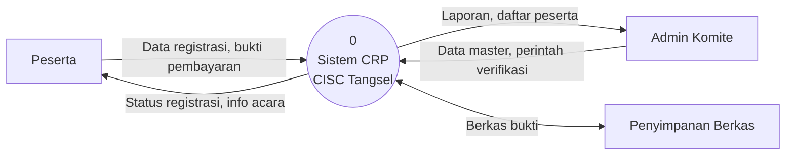
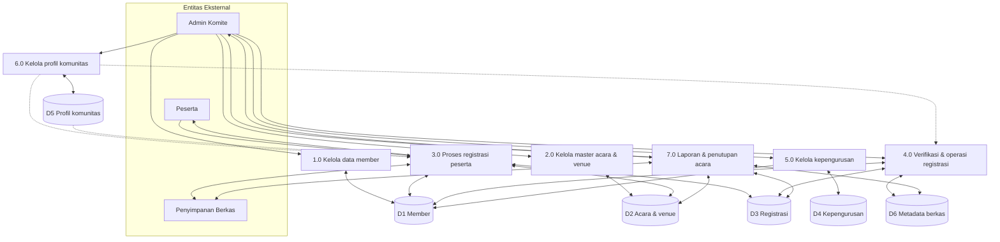
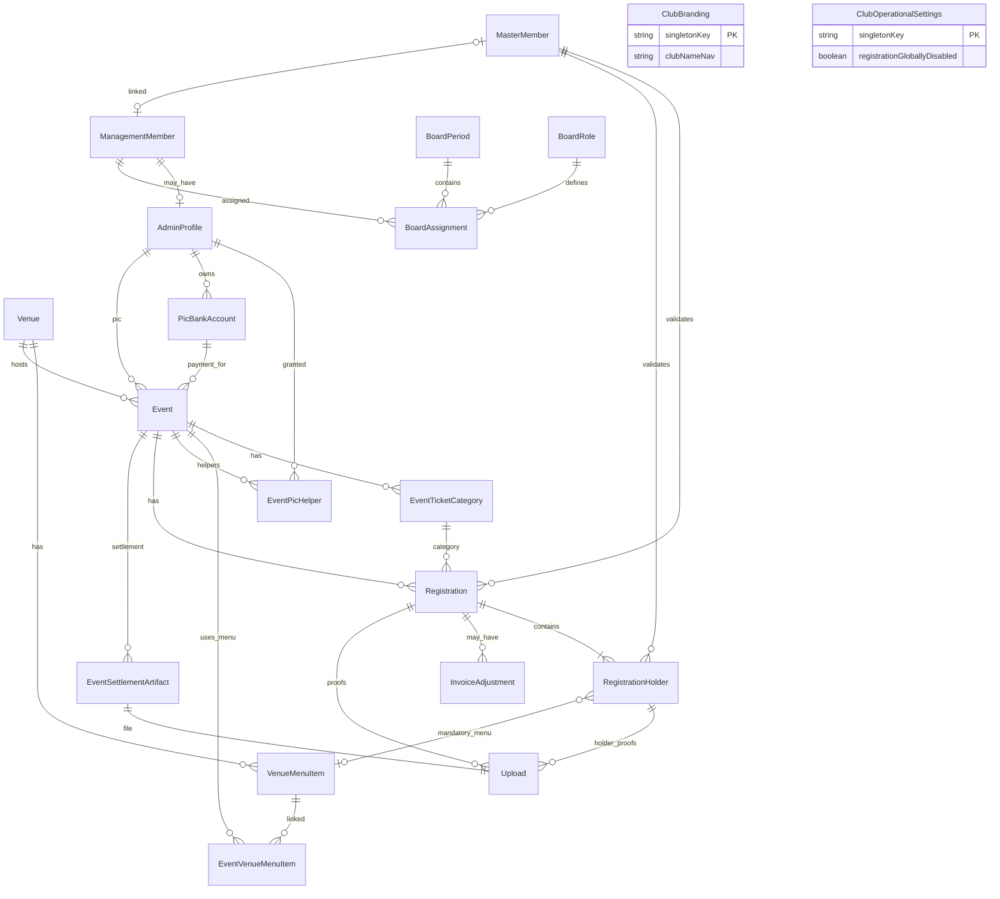

# CRP CISC Tangsel — Konsep Sistem Digital (Tugas Kuliah Konsep SI)

**Tanggal:** 2026-05-26  
**Proyek:** `match-screening` (Community Resource Planner — CRP)  
**Cakupan dokumentasi:** **As-is** (sistem yang sudah diimplementasi)  
**Deliverable tugas:** konsep sistem digital, **DFD** (Gane-Sarson, Level 0 + 1), **ERD konseptual**  
**Bahasa laporan:** Indonesia  

## Keputusan desain (ringkas)

| Aspek | Keputusan |
|--------|-----------|
| Cakupan | As-is; fitur belum ada tidak dimodelkan di DFD/ERD utama |
| Sponsorship | Masalah & saran pengembangan saja (Bab I, III, VI) — **bukan** proses/data store utama |
| DFD | Notasi **Gane-Sarson**, **Level 0 + Level 1** |
| ERD | **Konseptual** (~18 entitas bisnis); tanpa tabel Better Auth (`User`, `Session`, …) |
| Struktur laporan | **Opsi 2 — Standar SI** (Bab I–VI + lampiran) |

---

## 1. Struktur laporan (Opsi 2 — disetujui)

### Bab I — Pendahuluan
- Latar belakang CISC Tangsel & digitalisasi operasional acara komunitas
- Identifikasi 5 masalah (lihat §2); sponsorship = belum terlayani sistem
- Rumusan masalah, tujuan, manfaat
- Ruang lingkup & batasan (as-is, modul §4.3)

### Bab II — Landasan teori
- Sistem informasi & sistem digital
- DFD Gane-Sarson (simbol, Level 0/1)
- ERD (entitas, relasi, kardinalitas)

### Bab III — Analisis sistem berjalan (manual / pra-CRP)
- Proses manual per modul
- Kebutuhan fungsional & non-fungsional

### Bab IV — Konsep sistem digital CRP
- Visi, aktor, modul, arsitektur konseptual, alur bisnis utama (naratif)

### Bab V — Perancangan alur & data
- DFD Level 0 & 1 (§5)
- Kamus data (§6)
- ERD konseptual (§7)

### Bab VI — Penutup
- Kesimpulan per modul
- Saran: sponsorship, pembayaran otomatis, integrasi WA API, dll.

### Lampiran
- A: DFD Level 0 & 1 (gambar besar)
- B: ERD konseptual
- C: (Opsional) tangkapan layar
- D: Daftar entitas & atribut kunci

---

## 2. Identifikasi masalah → modul sistem

| No | Masalah | Modul CRP (as-is) | Status |
|----|---------|-------------------|--------|
| 1 | Management data member | Direktori `MasterMember`, import/export CSV, validasi saat registrasi | Terimplementasi |
| 2 | Event management | `Event`, venue/menu, kategori tiket, registrasi publik, verifikasi admin, laporan, penutupan keuangan | Terimplementasi |
| 3 | Data pengurus & periodik | `BoardPeriod`, `BoardRole`, `ManagementMember`, `BoardAssignment` | Terimplementasi |
| 4 | Community profile | `ClubBranding`, `ClubOperationalSettings`, `ClubNotificationPreferences`, `ClubWaTemplate` | Terimplementasi |
| 5 | Sponsorship | — | **Di luar cakupan as-is**; uraikan sebagai kebutuhan masa depan |

---

## 3. Aktor & peran

| Aktor | Peran dalam sistem |
|--------|-------------------|
| **Peserta** | Mendaftar acara publik, mengunggah bukti transfer & kartu member (jika klaim) |
| **Admin Komite** | `Owner` / `Admin` / `Verifier` / `Viewer` — kelola master data, verifikasi registrasi, laporan |
| **PIC Acara** | Admin profil yang ditugaskan per acara; verifikasi & bukti penutupan (subset hak operasional) |
| **Penyimpanan Berkas** (eksternal) | Object storage (bukti transfer, kartu member, sampul acara, penutupan) — entitas eksternal di DFD |

Autentikasi admin memakai Better Auth; **tidak** dimodelkan di ERD konseptual (cukup disebut di arsitektur Bab IV).

---

## 4. Arsitektur konseptual (Bab IV)

```
[Peserta] ──HTTPS──► [Halaman Publik] ──┐
                                       ├──► [Aplikasi Web CRP] ──► [Basis Data PostgreSQL]
[Admin]   ──HTTPS──► [Panel Admin]  ──┘              │
                                                       └──► [Penyimpanan Berkas]
```

**Prinsip as-is:**
- Satu transaksi registrasi = satu `Registration` + banyak `RegistrationHolder` (satu per tiket)
- Total bayar peserta = harga tiket (menu wajib inklusif; alokasi venue dilacak di laporan)
- Status registrasi: `submitted → pending_review → approved | rejected | payment_issue | …`

---

## 5. DFD — Gane-Sarson

### 5.1 Legenda simbol

| Simbol | Nama | Pemakaian |
|--------|------|-----------|
| Kotak | Proses | 1.0, 2.0, … |
| Dua garis paralel / lingkaran ganda | Data store | D1, D2, … |
| Persegi panjang | Entitas eksternal | Peserta, Admin, … |
| Panah berlabel | Alur data | Nama data di sisi panah |

### 5.2 DFD Level 0 (Diagram Konteks)

**Satu proses pusat:** `0` — **Sistem CRP CISC Tangsel**

**Entitas eksternal:**
- E1 — Peserta  
- E2 — Admin Komite  
- E3 — Penyimpanan Berkas  

**Alur data utama (antara entitas ↔ proses 0):**

| Alur | Arah | Keterangan |
|------|------|------------|
| Data registrasi & bukti pembayaran | E1 → 0 | Form pendaftaran, bukti transfer, foto kartu member |
| Status & instruksi acara | 0 → E1 | Konfirmasi submit, informasi pembayaran |
| Perintah kelola master & verifikasi | E2 → 0 | CRUD member, acara, pengurus, profil; approve/reject |
| Laporan & ekspor | 0 → E2 | Rekap registrasi, CSV, laporan keuangan |
| Unggah / unduh berkas | 0 ↔ E3 | Bukti transfer, gambar, bukti penutupan |



*Catatan untuk tugas: gambar ulang dengan simbol Gane-Sarson resmi (kotak proses, bukan bulat) di draw.io / Visio.*

### 5.3 DFD Level 1

Proses `0` dipecah menjadi **7 proses** dan **6 data store**.

**Data store:**

| ID | Nama | Isi utama |
|----|------|-----------|
| D1 | Member | `MasterMember` |
| D2 | Acara & venue | `Event`, `Venue`, `VenueMenuItem`, `EventVenueMenuItem`, `EventTicketCategory`, `PicBankAccount`, `EventPicHelper` |
| D3 | Registrasi | `Registration`, `RegistrationHolder`, `InvoiceAdjustment` |
| D4 | Kepengurusan | `BoardPeriod`, `BoardRole`, `ManagementMember`, `BoardAssignment` |
| D5 | Profil komunitas | `ClubBranding`, `ClubOperationalSettings`, `ClubNotificationPreferences`, `ClubWaTemplate` |
| D6 | Metadata berkas | Referensi `Upload`, `EventSettlementArtifact` (path/URL ke E3) |

**Proses Level 1:**

#### 1.0 — Kelola data member
- **Input:** perintah Admin (tambah/ubah/import/export), data member  
- **Output:** direktori member terbaru → D1  
- **Alur:** E2 → 1.0 → D1; D1 → 3.0 (validasi klaim nomor member)

#### 2.0 — Kelola master acara & venue
- **Input:** data acara, venue, menu, kategori tiket, PIC, rekening  
- **Output:** konfigurasi acara aktif → D2  
- **Alur:** E2 → 2.0 ↔ D2; D2 → 3.0 (jadwal & harga); D2 → 7.0 (parameter laporan)

#### 3.0 — Proses registrasi peserta
- **Input:** formulir registrasi, pilihan kategori/qty, data holder, bukti transfer  
- **Output:** registrasi baru (`submitted` / `pending_review`), metadata unggahan → D3, D6; berkas → E3  
- **Alur:** E1 → 3.0; 3.0 ↔ D1 (cek nomor member); 3.0 → D3, D6; 3.0 → E3; 3.0 → E1 (konfirmasi)

#### 4.0 — Verifikasi & operasi registrasi
- **Input:** keputusan verifikasi, penyesuaian invoice, kehadiran, pembatalan/refund  
- **Output:** status registrasi mutakhir → D3  
- **Alur:** E2 → 4.0 ↔ D3; 4.0 ↔ D1; 4.0 ↔ D6; 4.0 → E1 (via template WA — manual click-to-chat, di luar DFD detail)

#### 5.0 — Kelola kepengurusan
- **Input:** periode, jabatan, penugasan pengurus  
- **Output:** struktur kepengurusan → D4; sinkron flag `isManagementMember` → D1  
- **Alur:** E2 → 5.0 ↔ D4; 5.0 → D1

#### 6.0 — Kelola profil & kebijakan komunitas
- **Input:** branding, banner operasional, template WA, preferensi notifikasi (Owner)  
- **Output:** profil & kebijakan → D5  
- **Alur:** E2 → 6.0 ↔ D5; D5 → 3.0 (penutupan registrasi global, banner); D5 → 4.0 (template pesan)

#### 7.0 — Laporan & penutupan acara
- **Input:** permintaan laporan, unggahan bukti rekapitulasi (PIC/Admin)  
- **Output:** agregat keuangan & kehadiran, CSV; artefak penutupan → D6  
- **Alur:** E2 → 7.0; 7.0 ↔ D2, D3, D6; 7.0 → E2; 7.0 → E3



### 5.4 Alur data antar proses (ringkas)

| Dari | Ke | Data |
|------|-----|------|
| 1.0 | 3.0 | Validasi `memberNumber`, status aktif |
| 2.0 | 3.0 | Harga kategori, kapasitas, jadwal buka/tutup registrasi |
| 3.0 | 4.0 | Registrasi status `pending_review` |
| 5.0 | 1.0 | Derivation `isManagementMember` |
| 6.0 | 3.0 | Flag penutupan registrasi global, pesan banner |
| 2.0, 3.0 | 7.0 | Data agregasi laporan & penutupan |

---

## 6. Kamus data (cuplikan untuk Bab V.3)

| Alur data | Sumber | Tujuan | Deskripsi | Media |
|-----------|--------|--------|-----------|-------|
| Data registrasi | Peserta | 3.0 | Kontak, kategori tiket, qty, data per holder | Form web |
| Bukti transfer | Peserta | E3 via 3.0 | Gambar bukti pembayaran | Upload |
| Direktori member | 1.0 | D1 | Nomor member, nama, WA, status aktif | DB |
| Konfigurasi acara | 2.0 | D2 | Judul, slug, timeline, venue, menu, PIC | DB |
| Status verifikasi | 4.0 | D3 | approved / rejected / payment_issue, dll. | DB |
| Struktur kepengurusan | 5.0 | D4 | Periode, jabatan, penugasan | DB |
| Profil komunitas | 6.0 | D5 | Logo, nama nav, template WA | DB |
| Laporan acara | 7.0 | Admin | CSV, rekapitulasi keuangan | Export file |

*(Lengkapi tabel di laporan dengan semua alur Level 0 & 1.)*

---

## 7. ERD konseptual

### 7.1 Entitas & atribut kunci

| Entitas | Atribut kunci / penting |
|---------|-------------------------|
| MasterMember | `memberNumber` (UK), `fullName`, `whatsapp`, `isActive`, `isManagementMember` |
| AdminProfile | `authUserId`, `role`, link ke ManagementMember (opsional) |
| ManagementMember | `publicCode`, `fullName`, link MasterMember (opsional) |
| BoardPeriod | `label`, `startsAt`, `endsAt` |
| BoardRole | `title`, `sortOrder`, hierarki `parentRoleId` |
| BoardAssignment | periode + pengurus + jabatan |
| Venue | `name`, `address`, `mapUrl` |
| VenueMenuItem | `name`, `price` (IDR), venue |
| Event | `slug`, `title`, timeline registrasi/gate, `status`, PIC, rekening |
| EventVenueMenuItem | menu acara (snapshot venue) |
| EventTicketCategory | `regularPrice`, `memberPrice`, `capacity` |
| EventPicHelper | admin helper per acara |
| PicBankAccount | rekening milik admin PIC |
| Registration | kontak, status, `computedTotalAtSubmit`, kategori |
| RegistrationHolder | per tiket: nama, validasi member, harga, menu wajib |
| InvoiceAdjustment | underpayment / lainnya |
| Upload | metadata berkas (bukti, foto, penutupan) |
| EventSettlementArtifact | bukti penutupan + nominal |
| ClubBranding | logo, nama komunitas |
| ClubOperationalSettings | penutupan registrasi global, banner |
| ClubNotificationPreferences | mode notifikasi keluar |
| ClubWaTemplate | template pesan per keperluan |

### 7.2 Relasi utama (kardinalitas)

| Relasi | Kardinalitas | Keterangan |
|--------|--------------|------------|
| Venue — VenueMenuItem | 1 : N | Katalog menu per venue |
| Venue — Event | 1 : N | Acara diadakan di venue |
| Event — EventTicketCategory | 1 : N | Beberapa kategori tiket |
| Event — Registration | 1 : N | Banyak pendaftar |
| Registration — RegistrationHolder | 1 : N | Satu transaksi, banyak tiket |
| Registration — InvoiceAdjustment | 1 : N | Opsional |
| Registration / Holder — Upload | 1 : N | Bukti terkait |
| MasterMember — Registration(Holder) | 1 : N | Opsional setelah validasi |
| BoardPeriod — BoardAssignment | 1 : N | Periode berisi banyak penugasan |
| ManagementMember — BoardAssignment | 1 : N | Satu orang banyak jabatan/periode |
| BoardRole — BoardAssignment | 1 : N | |
| ManagementMember — AdminProfile | 1 : 0..1 | Pengurus bisa punya akun admin |
| Event — EventSettlementArtifact | 1 : N | Riwayat bukti penutupan |
| AdminProfile — PicBankAccount | 1 : N | Rekening milik admin |
| PicBankAccount — Event | 1 : N | Rekening pembayaran per acara |

### 7.3 Diagram ERD (Mermaid)



*Entitas singleton profil komunitas (`ClubBranding`, dll.) tidak direlasikan ke Event di DB; pengaruhnya melalui kebijakan global (jelaskan naratif di Bab V).*

### 7.4 Entitas sengaja di luar ERD

- `User`, `Session`, `Account`, `TwoFactor`, `Verification` — autentikasi Better Auth  
- `AdminInvitation` — onboarding admin (bisa disebut di teks, opsional di diagram)  
- `ClubAuditLog` — audit konfigurasi Owner  
- **Sponsorship** — belum ada model  

---

## 8. Narasi alur bisnis utama (untuk Bab IV.5)

1. **Admin** menyiapkan venue, acara, kategori tiket, PIC, dan rekening (2.0).  
2. **Peserta** mengisi form publik, sistem menghitung total tiket, menyimpan registrasi dan bukti (3.0).  
3. **Verifier/Admin** meninjau bukti & validasi member, mengubah status (4.0).  
4. Setelah acara, **PIC/Admin** mengisi kehadiran, laporan, dan bukti penutupan (7.0).  
5. **Owner** mengubah branding/kebijakan komunitas sesuai kebutuhan (6.0).  
6. **Pengurus** dikelola per periode dengan penugasan jabatan (5.0).

---

## 9. Sponsorship (hanya naratif)

**Masalah:** belum ada pencatatan sponsor, paket sponsorship, atau penempatan logo sponsor per acara.  
**Posisi as-is:** di luar DFD Level 1 dan ERD.  
**Saran Bab VI:** modul masa depan dengan entitas konseptual `Sponsor`, `SponsorshipPackage`, `EventSponsorship` — tidak didokumentasikan sebagai implementasi saat ini.

---

## 10. Checklist penyelesaian tugas

- [ ] Bab I–VI sesuai §1  
- [ ] DFD Level 0 & 1 digambar Gane-Sarson (draw.io / Visio) dari §5  
- [ ] Kamus data lengkap dari §6  
- [ ] ERD dari §7 (export Mermaid atau redraw)  
- [ ] Sponsorship hanya di masalah & saran, bukan diagram utama  
- [ ] Konsistensi istilah: Registrasi, Holder, Verifikasi, CRP  

---

## 11. Sumber acuan implementasi

- Schema: `prisma/schema.prisma`  
- Arsitektur produk: `CLAUDE.md`, `docs/superpowers/specs/2026-05-02-event-management-admin-design.md`  
- Diagram lama (tidak dipakai untuk tugas): `docs/superpowers/diagrams/2026-04-29-nobar-cisc-tangsel/` — mengacu MVP usang (model TICKET/partner)
